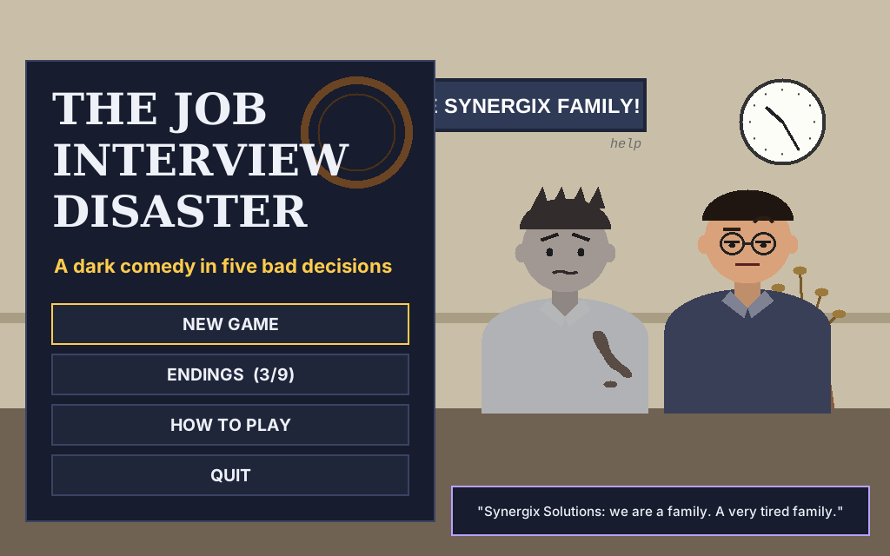
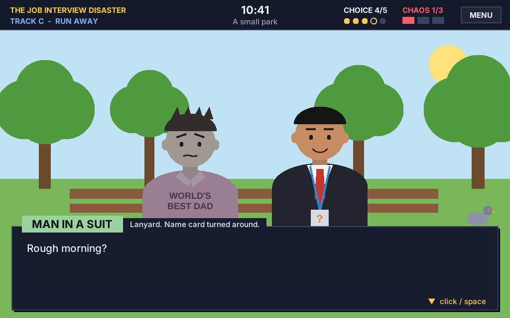
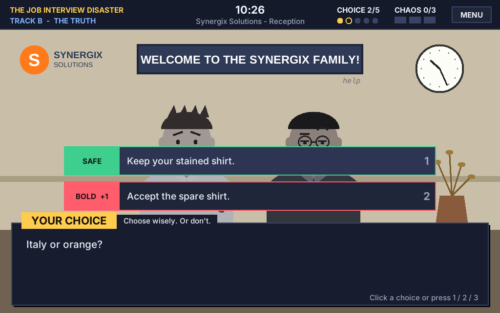

# The Job Interview Disaster

An interactive "choose your own adventure" story with dark humour, written in Python.

Everything goes wrong on the day of your job interview. Your alarm didn't ring, your train was late, and a stranger spilled coffee on your only white shirt (the stain looks like a map of Italy). You arrive at **Synergix Solutions** at 10:25, for a 10:00 interview. Mayeul, the receptionist, is already judging you.



| Story with HUD | Choices |
|---|---|
|  |  |

---

## How to run the game

You only need **Python 3** (download it from https://www.python.org). There's nothing else to install, because the graphics use `tkinter`, which comes with Python.

| Computer | How to start |
|---|---|
| **Windows** | Double-click **`Play_Windows.bat`** (or open a terminal in the folder and type `py game.py`) |
| **Mac** | Double-click **`Play_Mac_Linux.command`** (or type `python3 game.py` in the Terminal) |
| **Linux** | `./Play_Mac_Linux.command` or `python3 game.py` |
| **Text version** (terminal only) | `python game.py --terminal` |

> On Linux, if you see `No module named tkinter`, install it with `sudo apt install python3-tk`. Until you do, the game starts in text mode automatically.

### Controls

| Action | Mouse | Keyboard |
|---|---|---|
| Continue the dialogue | Click anywhere | `SPACE` or `ENTER` |
| Make a choice | Click a button | `1`, `2` or `3` |
| Back to the menu | **MENU** button | `ESC` |
| On the ending screen | Buttons | `R` = play again, `M` = menu |

### Optional: make one single app (`.exe`)

If you want to give the game to someone who doesn't have Python:

```
pip install pyinstaller
pyinstaller --onefile --windowed --name JobInterviewDisaster game.py
```

The app will be in the `dist/` folder.

---

## The game rules

- Every path has **exactly 5 choices** before an ending.
- **Choice 1** (Scene 0) picks the track: **A) Lie**, **B) Tell the truth** or **C) Run away**.
- **Choices 2, 3 and 4** each have a **SAFE** option and a **BOLD** option. A BOLD option gives **+1 Chaos**. Both options lead to the same next scene, but the characters react differently.
- **Choice 5** is the final decision: SAFE or BOLD.

| Final choice | Chaos (from choices 2–4) | Ending |
|---|---|---|
| SAFE | any | **Calm** |
| BOLD | 0 or 1 | **Medium** |
| BOLD | 2 or 3 | **Wild** |

### Story map

```
                         PROLOGUE (station)
                               |
                 SCENE 0 - Mayeul: "You're the 10 o'clock interview?"
          _____________________|_____________________
         |                     |                     |
     A) LIE                B) TRUTH             C) RUN AWAY
   A1 Who exactly?      B1 Spare shirt?      C1 The cyclist
   A2 The "patient"     B2 A time you failed  C2 Mum calls
   A3 Difficult sit.    B3 Why this job?      C3 Man with a lanyard
   A4 Job offer!        B4 Mrs. Bennett!      C4 "We're hiring"
         |                     |                     |
   1 Hired by Pity      4 Boss Is Your Old    7 Unemployed but Happy
   2 Hired by Accident    Teacher             8 The Rival Company
   3 The Funeral of a   5 The Job You Didn't  9 It Was a Test (secret)
     Perfectly Healthy    Apply For
     Grandma            6 The Viral Intern
```

3 tracks × 2 × 2 × 2 × 2 = **48 different paths** and **9 endings**. The game remembers which endings you found (see **ENDINGS** in the menu).

---

## How the code works (for the presentation)

The project is split into 4 files. Each file has one job:

| File | Job | What's inside |
|---|---|---|
| `story.py` | **Data** | All the text: characters, scenes, choices, endings. No logic. |
| `engine.py` | **Rules** | The `Game` class: Chaos counter, tracks, ending rules. |
| `game.py` | **App / launcher** | The window: main menu, HUD, drawings, dialogue box, buttons. |
| `terminal.py` | **Text version** | The same game with `print()` and `input()`. |

### 1. A scene is a dictionary (`story.py`)

```python
"A1": {
    "number": 2, "track": "A",                 # choice 2 of 5, track A
    "place": "reception", "time": "10:26",     # background + clock in the HUD
    "cast": ["you", "mayeul"],                 # who is on screen
    "lines": [                                 # (speaker, text); None = narrator
        ("mayeul", "Who exactly?"),
    ],
    "question": "Who is your 'emergency'?",
    "choices": [
        {"label": "My grandmother...", "kind": "safe", "chaos": 0, "next": "A2",
         "reaction": [...]},
        {"label": "My goldfish...",    "kind": "bold", "chaos": 1, "next": "A2",
         "reaction": [...]},
    ],
},
```

Both choices have the same `"next"` scene but a different `"reaction"`.

### 2. The ending rules (`engine.py`)

```python
def get_ending_type(final_choice_is_bold, chaos):
    if not final_choice_is_bold:
        return "calm"
    if chaos <= 1:
        return "medium"
    return "wild"
```

When the player clicks a choice, `Game.choose()`:
1. adds the choice's Chaos points (`self.chaos += choice["chaos"]`),
2. remembers the track (A, B or C) and the shirt (white, orange or pink),
3. either goes to the `"next"` scene, or, if it was the final choice, finds the ending with `get_ending_type()`.

### 3. The interface (`game.py`)

Everything is drawn on one `tkinter.Canvas`, like a 2D visual novel:
- **HUD** (top bar): track, time and place, choice progress (5 dots), **CHAOS meter** (3 red bars), MENU button.
- **Stage**: a background for each place (station, reception, office, street, park, funeral) and characters drawn with simple shapes (ovals, rectangles, lines). The person who is talking moves up, and the others turn grey.
- **Dialogue box**: name plate + text that appears letter by letter.
- **Choice buttons**: green **SAFE**, red **BOLD +1**, orange **BOLD** for the final decision.
- **Ending card**: ending name, type (Calm/Medium/Wild), final Chaos score and your 5 choices, then **Play again**.

The graphical version and the terminal version both use the same `Game` class, so the rules are written only once.

### How to add a new scene

1. Copy a scene in `story.py` and give it a new id (for example `"A5"`).
2. Change its `lines`, `question` and `choices`.
3. Put `"next": "A5"` in the choices of the scene before it.

---

## Characters

- **You**: a recent graduate with one clean shirt and a lot of anxiety.
- **Mayeul**: the receptionist. He sees everything and judges silently.
- **Mr. Hargrove**: the HR manager. Always smiling, always taking notes.
- **Mrs. Bennett**: the CEO, and your old English teacher, who once said you "would never amount to anything".
- **Synergix Solutions**: a company that says it is "a family" (a very tired family).
